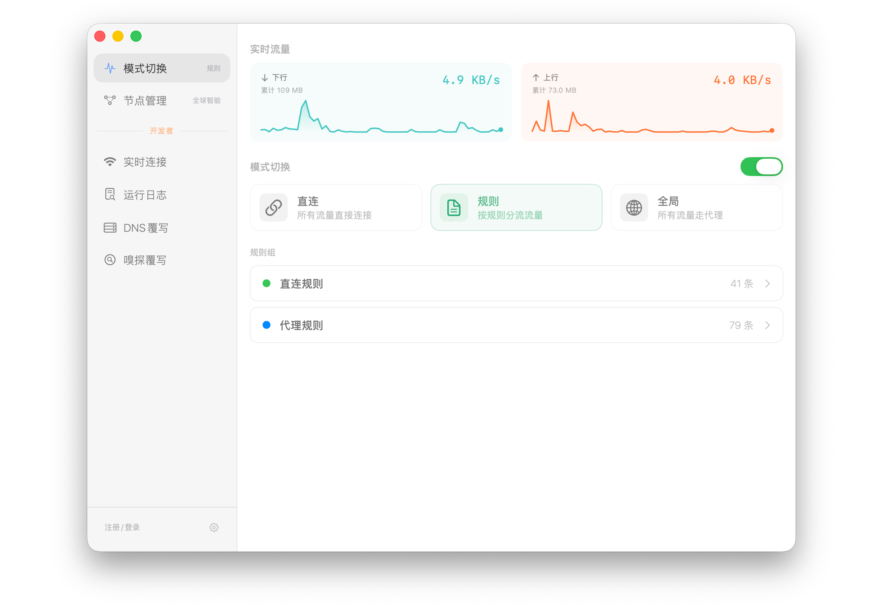
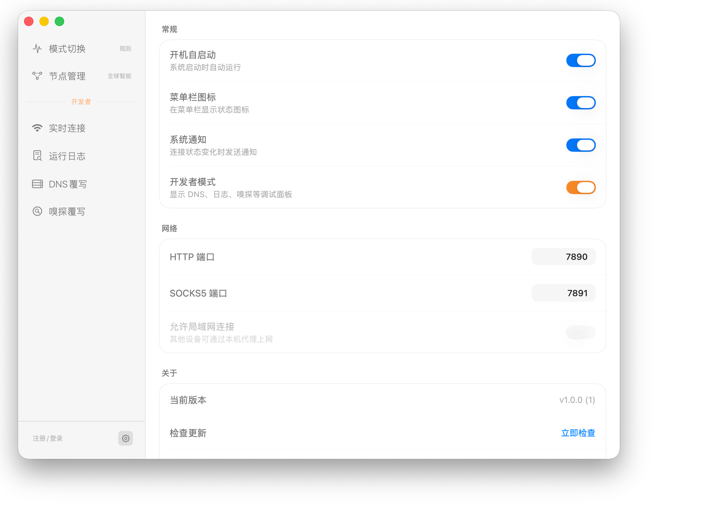
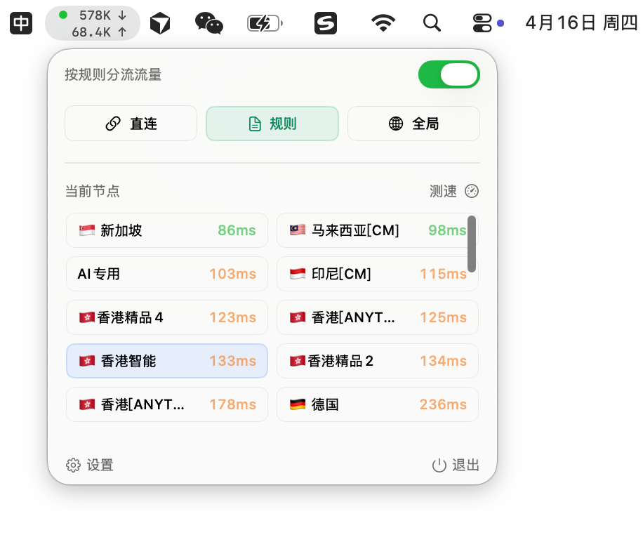

  
  
  <h1>AirTiz 小梯子</h1>
  
  
轻巧安全的 VPN 客户端，专为 Mac 打造

  
  
  
  
   
  
  
  

    <a href="https://airtiz.net">🌐 访问官网</a> • 
    <a href="https://github.com/lattegou/airtiz/releases">⬇️ 下载最新版</a>
  

  

  
  

## 简介

AirTiz 是一款专为 macOS 打造的轻量级 VPN 客户端，基于苹果原生 **SwiftUI** 与高性能内核 **mihomo** 构建。托盘优先的交互设计让高频操作一触即达，菜单栏实时网速一目了然——轻量与颜值并重，效率与体验兼顾。

## 特性

🍎 **原生 Mac 体验** — 采用 Swift / SwiftUI 原生技术栈，轻量、高性能、与系统风格浑然一体。

🎯 **托盘快捷操作** — 开关切换、模式选择、节点切换等高频操作无需唤醒主界面，专注你的工作流。

📊 **实时网速监控** — 菜单栏直观展示上下行网速与分流模式，也可单纯作为网速查看工具使用。

🔒 **安全隐私优先** — 架构加密通信，不追踪任何用户，绝不访问用户网络流量数据。

## 系统要求

- macOS 12.0 及以上版本
- Apple Silicon（Intel 版本敬请期待）

## 下载安装

前往 [GitHub Releases](https://github.com/lattegou/airtiz/releases) 下载最新版本的 `.dmg` 安装包，打开后将 AirTiz 拖入「应用程序」文件夹即可。

也可以在 [官网](https://airtiz.net) 点击「下载」按钮获取。

## 限时活动

内测阶段，**前 800 名用户可获得免费终生会员**：

- 享受额外 10% 高级功能
- 专属反馈渠道，功能建议快速响应

## 使用说明

AirTiz 是一款**图形界面客户端**，代理功能由开源内核 mihomo 提供。AirTiz 本身**不提供 VPN 服务器或代理节点**，您需要自行配置订阅后使用。

## 联系我们

- 邮箱：lattegou@gmail.com
- 官网：[airtiz.net](https://airtiz.net)

---

© LATTEGOU LLC. All rights reserved.

